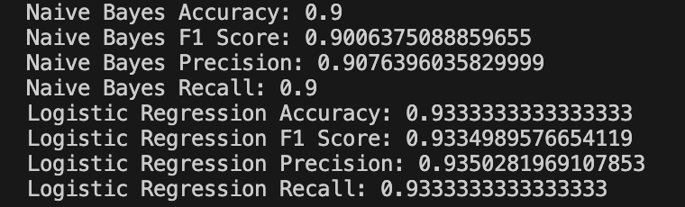
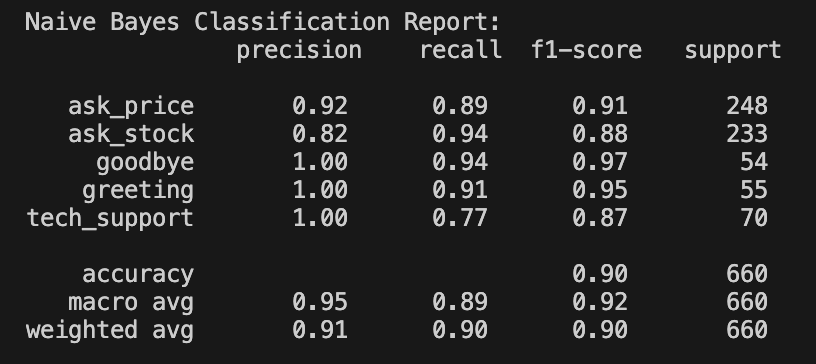
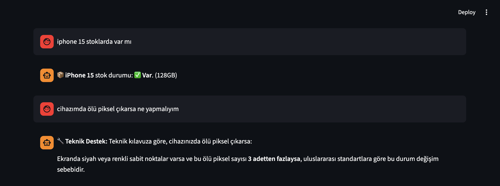
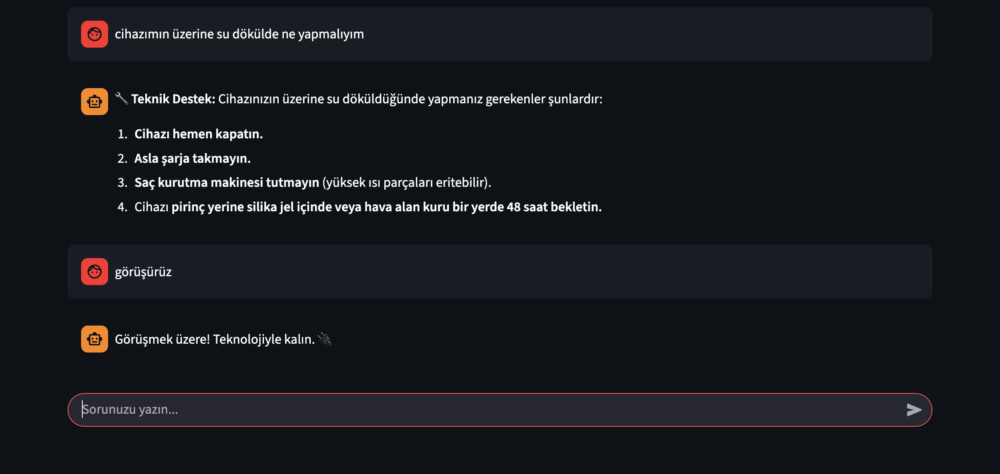
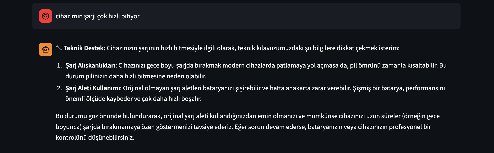

# 🤖 TeknoMarket AI Asistanı (Hibrit Chatbot Projesi)

Bu proje, bir teknoloji mağazası için geliştirilmiş **Hibrit Yapay Zeka Asistanıdır**. 
Sistem, kullanıcıların doğal dilde sorduğu soruları anlamak için **Makine Öğrenmesi (Machine Learning)**, ürün sorguları için **Excel Veritabanı** ve teknik destek soruları için **RAG (Retrieval-Augmented Generation)** teknolojisini birleştirir.

---

## 🚀 Özellikler

- **🧠 Niyet Analizi (Intent Recognition):** Kullanıcının ne istediğini (Fiyat mı, Stok mu, Destek mi?) anlamak için **Logistic Regression** modeli kullanır. Yazım hatalarını ve sokak ağzını ("Hocam", "Reis" vb.) anlayabilir.
- **📊 Dinamik Ürün Sorgulama:** Mağaza envanterini (`.xlsx`) anlık olarak tarar. Fiyat ve stok bilgisini nokta atışı verir.
- **🔧 Akıllı Teknik Destek (RAG):** Teknik servis kılavuzunu (`.pdf`) okuyarak, "Telefon suya düştü ne yapayım?" gibi karmaşık sorulara **Google Gemini AI** desteğiyle cevap verir.
- **💬 Doğal Dil İşleme (NLP):** Kullanıcıyla insan gibi selamlaşır ve vedalaşır.
- **📈 Yüksek Doğruluk:** Eğitilen model, test verilerinde **%93 Başarı Oranı (Accuracy)** yakalamıştır.

---

## 🛠️ Kullanılan Teknolojiler

* **Dil:** Python 3.11+
* **Arayüz:** Streamlit
* **Makine Öğrenmesi:** Scikit-learn (Logistic Regression, TF-IDF)
* **LLM & RAG:** LangChain, Google Gemini API, ChromaDB
* **Veri İşleme:** Pandas, PyPDFLoader
* **Veri Seti:** Sentetik Veri Üretimi (Data Augmentation) ile oluşturulmuş 3000+ satırlık veri seti.

---

## 📂 Proje Yapısı

```bash
chatbot_project/
│
├── app.py                # Ana uygulama (Streamlit arayüzü ve bot mantığı)
├── generate_intents.py   # Veri seti üretici (Data Augmentation yapar)
├── model.py              # ML modelini eğiten ve kaydeden kod
├── requirements.txt      # Gerekli kütüphaneler
├── README.md             # Proje dokümantasyonu
│
├── data/                 # Veri Kaynakları
│   ├── tek_market.xlsx   # Ürün ve fiyat listesi
│   ├── tech_manual.pdf   # Teknik servis kılavuzu
│   └── intents.xlsx      # generate_intents.py tarafından üretilen eğitim verisi
│
├── models/               # Eğitilmiş Modeller (.pkl dosyaları)
│   ├── lr_intent_model.pkl
│   └── tfidf_vectorizer.pkl
│
└── .env                  # API Anahtarları (Google Gemini)
```


⚙️ Kurulum ve Çalıştırma
Projeyi kendi bilgisayarınızda çalıştırmak için adımları takip edin:

1. Gereksinimleri Yükleyin
Terminali açın ve gerekli kütüphaneleri indirin:
pip install -r requirements.txt
(Not: requirements.txt dosyanız yoksa şu paketleri kurun: streamlit pandas scikit-learn langchain-google-genai langchain-community langchain-chroma python-dotenv joblib openpyxl pypdf)

2. API Anahtarını Ayarlayın
Ana dizinde .env adında bir dosya oluşturun ve içine Google API anahtarınızı ekleyin:
GOOGLE_API_KEY=AIzaSyDxxxxxxxxxxxxxxxxxxxx

3. Veri Setini ve Modeli Oluşturun
Botun çalışması için önce veriyi üretmesi ve beynini eğitmesi gerekir. Sırasıyla şu komutları çalıştırın:
    1. Adım: Veri setini oluştur (Sentetik veri üretimi)
python generate_intents.py

    2. Adım: Yapay zekayı eğit (Logistic Regression)
python model.py

4. Uygulamayı Başlatın
Artık asistanı çalıştırabilirsiniz:
streamlit run app.py


### 📊 Model Performans Değerleri
Projede **Naive Bayes** ve **Logistic Regression** algoritmaları karşılaştırılmıştır. 

- **Logistic Regression**, özellikle teknik destek ve stok sorgularında gösterdiği **%93 Doğruluk (Accuracy)** ve **0.93 F1-Score** ile ana model olarak seçilmiştir.
- **Recall (Duyarlılık)** değerinin yüksek olması, botun kullanıcı taleplerini gözden kaçırmadığını kanıtlar.






Some images to see how it works.

### 🛍️ Doğal Dil Etkileşimi ve Fiyat Sorgulama
Bot, kullanıcıyla doğal bir dilde selamlaşır ve ürün sorgularını anlar.
* **Mekanizma:** Kullanıcının *"iPhone 15 fiyatı nedir?"* sorusu `ask_price` niyeti olarak sınıflandırılır. Sistem, Excel veritabanını tarayarak ürünün markasını ve güncel fiyatını getirir.


### 🔄 Hibrit Mimari Örneği (Excel + RAG)
Bu ekran görüntüsü, sistemin bağlam değiştirme (Context Switching) yeteneğini gösterir.
1.  **Stok Sorgusu:** İlk soruda ("stoklarda var mı"), bot Excel'e gidip `Stok: Var` bilgisini çeker.
2.  **Teknik Destek:** İkinci soruda ("ölü piksel"), bot bunun bir teknik sorun olduğunu anlar ve **RAG sistemini** devreye sokarak PDF kılavuzundaki "Değişim Şartları"nı okur.



### 🔧 RAG Tabanlı Teknik Destek (Sıvı Teması)
Kullanıcı "su döküldü" gibi acil bir durum bildirdiğinde, sistem `tech_manual.pdf` dosyasını tarar.
* **LLM Desteği:** Google Gemini, dokümandaki karmaşık paragrafları okuyarak kullanıcıya **adım adım uygulanması gereken güvenli talimatları** (Kapat, Şarja takma, Silika jel kullan vb.) listeler.



### 🔋 Detaylı Bilgilendirme ve Teşhis
Sadece basit cevaplar değil, kullanıcıyı eğiten detaylı açıklamalar sunulur.
* **Örnek:** Batarya sorunlarında, kılavuzda yer alan "Şarj Alışkanlıkları" ve "Orijinal Alet Kullanımı" gibi kritik uyarılar, kullanıcıya özetlenerek sunulur.



## 🔮 Gelecek Çalışmalar (Future Work)

Bu proje şu an prototip aşamasında olup, ilerleyen süreçte şu özelliklerle geliştirilmesi planlanmaktadır:

- [ ] **SQL Veritabanı Entegrasyonu:** Şu an Excel (`.xlsx`) üzerinde tutulan verilerin, daha büyük ölçekli ve hızlı işlem için **PostgreSQL** veya **SQLite** veritabanına taşınması.
- [ ] **Sesli Asistan Özelliği:** Kullanıcının mikrofon aracılığıyla sorusunu sesli sorması ve cevabı sesli dinlemesi (Speech-to-Text & Text-to-Speech).
- [ ] **Kullanıcı Geri Bildirim Döngüsü:** Kullanıcının botun cevabını beğenip beğenmediğini (👍/👎) oylayabileceği ve modelin bu geri bildirimlerle kendini yeniden eğiteceği bir sistem.
- [ ] **Canlı Destek Bağlantısı:** Botun çözemediği durumlarda sohbeti gerçek bir insan temsilciye aktarması.

## 🆘 Sorun Giderme (Troubleshooting)

Projeyi çalıştırırken şu hatalarla karşılaşırsanız çözüm adımlarını izleyin:

**Hata 1: `GoogleGenerativeAIError` veya API Yanıt Vermiyor**
* **Sebep:** API kotanız dolmuş veya `.env` dosyasındaki anahtar hatalı olabilir.
* **Çözüm:** Google AI Studio'dan yeni bir API Key alın ve `.env` dosyasını güncelleyin.

**Hata 2: `FileNotFoundError: data/tek_market.xlsx`**
* **Sebep:** Python dosyayı bulamıyor.
* **Çözüm:** Terminalde doğru klasörde olduğunuzdan emin olun (`chatbot_project` ana dizininde olmalısınız).

**Hata 3: Model Yüklenemedi Hatası**
* **Sebep:** Modeller henüz eğitilmemiş.
* **Çözüm:** Sırasıyla `python generate_intents.py` ve `python model.py` komutlarını çalıştırın.

## 📬 İletişim

Sorularınız veya önerileriniz için:
* **E-posta:** selimtasli100@gmail.com
* **GitHub:** https://github.com/selimtasli
* **LinkedIn:** https://www.linkedin.com/in/selim-ta%C5%9Fl%C4%B1/

